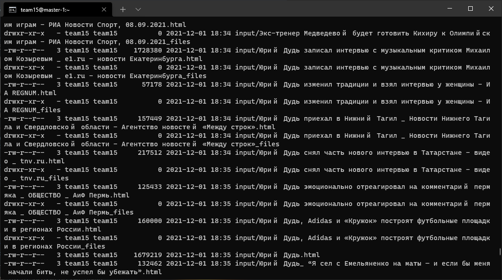
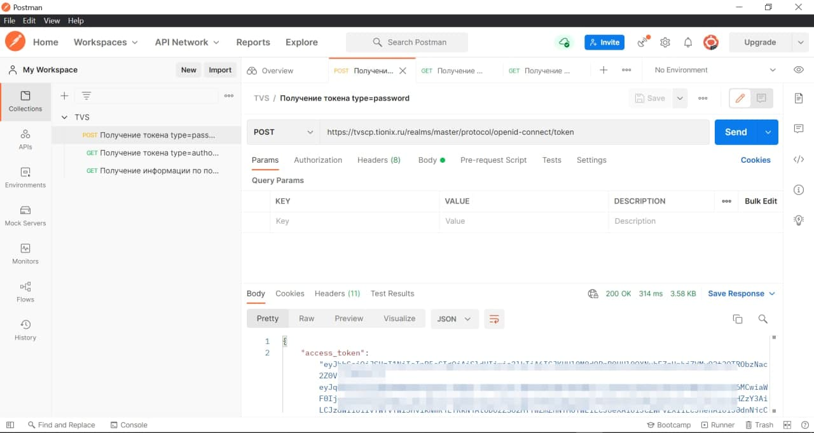
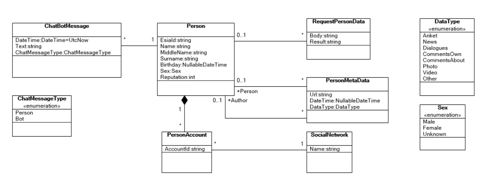

# leadersofdigital2021
Репозиторий с результатами работы на хакатоне "Цифровой прорыв" (финал) команды `Траектория времени`.

# Описание технического решения

## Большие данные

Данные располагаются в Hadoop Arenadata. Реализовано хранилище и сервис для работы с ним.
Пример данных в хранилище:


## Аутентификация через ЕСИА

Для аутентификации используется сервис TVS. Пример запроса к сервису аутентификации:


## Стек сервисов в кластере DE

### Шаги по настройке DE

Пример использованных команд для управления кластером (не все использованные команды):

```sh
kubectl get pods --kubeconfig=kubeconfig

kubectl describe quota --kubeconfig=kubeconfig

kubectl edit resourcequota team15 -n team15 --kubeconfig=kubeconfig

kubectl run metaverse-app --image=bratchikov/metaverse-app --port 80 --kubeconfig=kubeconfig --requests="cpu=2,memory=1G"

kubectl run metaverse-postgre-sql --image=bratchikov/metaverse-postgre-sql --port 5432 --kubeconfig=kubeconfig --requests="cpu=2,memory=1G"

kubectl expose pod metaverse-postgre-sql --port 5432 --type=NodePort -n team15 --kubeconfig=kubeconfig 

kubectl expose pod metaverse-app --port 80 --type=NodePort -n team15 --kubeconfig=kubeconfig 

kubectl get svc -n team15 --kubeconfig=kubeconfig

kubectl delete pod metaverse-app --kubeconfig=kubeconfig
kubectl delete service  test-app --kubeconfig=kubeconfig

kubectl delete pod test-app-db --kubeconfig=kubeconfig
kubectl delete service  test-app-db --kubeconfig=kubeconfig

```

### Хранилище оперативных данных и данных конфигурации сервиса

Для хранения оперативных данных использован PostgreSQL.

- [Скрипт создания БД](src/SQL/PostgreSql.create.sql)
- [Dockerfile](src/Docker/SQL/Dockerfile.PostgreSql)
- [Docker-образ](https://hub.docker.com/r/bratchikov/metaverse-postgre-sql)

### Бэкенд приложения

Бэкенд приложения предоставляет web-API для административного приложения и приложения чат-бота. Реализован на C# и поддерживает протокол OData.  
Модель данных:


- [Исходный код](src/Metaverse)
- [Dockerfile](src/Docker/Dockerfile)

### Фронтенд административного приложения

Фронтенд административного приложения реализован в виде SPA на EmberJS и упаковывается в тот же Docker-образ, что и бэкенд:

- [Исходный код](src/ember-app)

### ИИ-сервис для работы с данными в hadoop

Для обработки текстов и изображений на предмет оценки репутации используется сервис `data-processor`:

- [Исходный код](src/data-processor/)
- [Dockerfile](src/data-processor/Dockerfile)
